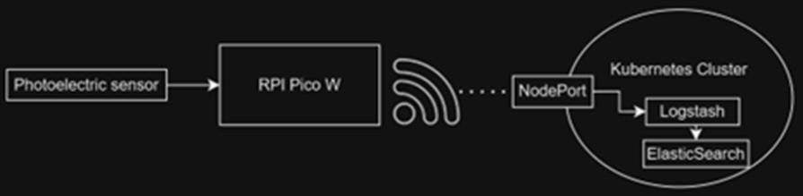

# MSCS Capstone Project - City University of Seattle

## Scalable Waste Management IoT using ELK and Kubernetes

This study proposes a scalable solution to address waste management inefficiencies by using IoT sensors and a Kubernetes-based ELK system to monitor waste bin levels and create dynamic service schedules. Incorporating real-time data, weather forecasts, and usage patterns, the system reduces trash overflow, improves environmental conditions, and enhances waste infrastructure on a large scale.
### System Diagram

### Photoelectric sensor

## Abstract
The current state of waste management is inefficient.  Trash overflow occurs due to delayed or neglected service schedules, leading to negative environmental effects such as toxic rain runoff, litter, and a decreased quality of living in affected areas.  This paper proposes a solution to address this widespread problem by collecting waste bin data which can be used to create tailor-made waste removal service schedules.  Using IoT devices along with Kubernetes, a real-time detection system can be established while also allowing for the ability to easily scale the application.  Implementing alerting and data collection will reduce waste bin overflows by ensuring prompt service based on bin level and frequency of use.  Additionally, incorporating other outside data including weather forecasts will help avoid toxic runoff caused by extreme rain and wind conditions.  The current state of waste management can be improved by applying sensors to trash bins, dumpsters, and containers and using that information to optimize the waste infrastructure management on a large scale. 

## Findings
Adding smart sensors to waste bins can help create service schedules that are based on real time data feeds.  By utilizing the Kibana dashboard to view the fullness of waste bins in real time, bins will have a lower likelihood of overflowing for extended periods of time.  On a large scale, this project could be scaled to thousands of bins due to the flexibility and scalability of the Kubernetes-based ELK application.  Additionally, data insights such as weather forecasts, scheduled events, and frequency of bin usage can be incorporated to further improve the service schedules.  This project improves upon similar research by implementing a scalable application that could support waste management infrastructure on a large scale. 

## Conclusion
Utilizing IoT, Kubernetes, ELK and sensors to monitor waste bins helps solve the core problem of trash overflow: fixed service schedules.  By automatically collecting waste bin data, schedules can be adjusted in real-time to reduce overflow and litter.  The basic concept of automating waste bin fullness has been demonstrated through this study.  Additionally, through the use of Kubernetes container orchestration system, the concept can be easily scalable to address waste overflow in large or highly populated areas.  
